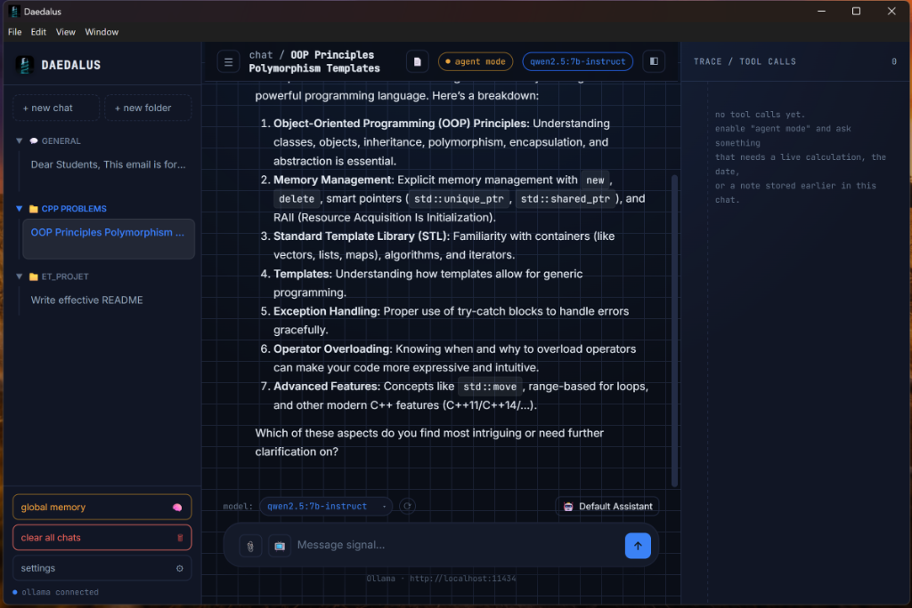

<div align="center">
  
  <h1>Daedalus</h1>
  <p><strong>A Privacy-First, Local-AI Workspace for Students & Power Users</strong></p>
  
  <a href="https://github.com/dhanunjaya007/DAEDALUS/stargazers"></a>
  <a href="https://github.com/dhanunjaya007/DAEDALUS/network/members"></a>
  <a href="https://github.com/dhanunjaya007/DAEDALUS/discussions"></a>
</div>

---

> **⭐️ Love Daedalus?** Please consider giving this repository a star! It helps the project grow and lets others discover this awesome local-AI tool. 

Daedalus is a completely offline, local AI chat application powered by **[Ollama](https://ollama.ai/)**. Designed as a "student-killer app," Daedalus keeps your data private while giving you powerful tools to analyze documents, write code, search the web, and study efficiently.

<div align="center">
  
</div>

## 🚀 Features

* **100% Local & Private:** No cloud APIs, no subscriptions, no tracking. Everything runs on your machine via Ollama.
* **Agentic Tool Calling:** Give your local model the ability to run scripts, calculate math, or search DuckDuckGo.
* **Document RAG (Retrieval-Augmented Generation):** Drag and drop `.pdf`, `.txt`, `.py`, `.cpp`, `.js` (and more!) to instantly query your documents. 
* **YouTube Summarization:** Paste a YouTube URL and Daedalus will fetch the transcript and summarize the video for you.
* **Global Memory & Personas:** Teach Daedalus facts about yourself, organize chats into Folders, and switch between Personas (e.g., Code Reviewer, Socratic Tutor).
* **Code Execution:** Safe sandbox to run Python and JavaScript directly within the chat to test logic or analyze data.
* **Glassmorphism UI:** A sleek, fully responsive interface with Matrix, Dark, and Light themes.

## 🛠️ Tech Stack

* **Frontend:** Vanilla HTML, CSS, JavaScript (Zero bloat)
* **Backend:** Node.js, Electron
* **AI Engine:** Ollama (Local LLM)
* **Embeddings:** `nomic-embed-text`
* **Parsing:** `pdf-parse`, `cheerio`, `youtube-transcript`

## 💻 System Requirements (Compute)

Because Daedalus runs models entirely locally on your own machine via Ollama, your hardware determines the performance.

* **Minimum:** 8GB RAM, modern multi-core CPU (Will run 7B or 8B models like `llama3` or `qwen2.5:7b` at reasonable speeds).
* **Recommended:** 16GB+ RAM, Apple Silicon (M1/M2/M3) OR a dedicated NVIDIA GPU with at least 8GB VRAM (e.g., RTX 3060 or better). This allows fast token generation and snappy document embeddings.
* **Disk Space:** ~100MB for the app, plus 4GB - 8GB per LLM you download through Ollama.

## 📦 Getting Started

There are two ways to run Daedalus: downloading the ready-to-use portable executable (recommended for most users) or running/building from source (for developers).

### Option 1: For Normal Users (Portable Executable)
You **do not** need Node.js installed for this option—only Ollama!

1. **Install Ollama:** Download and install [Ollama for Windows, Mac, or Linux](https://ollama.ai/download). Make sure the Ollama application is running in your system tray or background.
2. **Download AI Models:** Open your command prompt or terminal and pull the recommended chat model and embedding model (used for document RAG):
   ```bash
   ollama run qwen2.5:7b-instruct
   ollama pull nomic-embed-text
   ```
3. **Download & Run Daedalus:** Go to our [GitHub Releases](https://github.com/dhanunjaya007/DAEDALUS/releases), download **`Daedalus 1.0.0.exe`**, and double-click to start working immediately! No installer required.

---

### Option 2: For Developers (Run from Source)
If you want to contribute, modify the UI, or build from source, you will need both **Node.js** and **Ollama**.

#### 1. Install Prerequisites
* **Node.js:** Download and install [Node.js (v18+ or v20 LTS recommended)](https://nodejs.org/en/download/). Verify your installation by opening a terminal and running:
  ```bash
  node -v
  npm -v
  ```
* **Ollama:** Install [Ollama](https://ollama.ai/download), start it, and pull the required models:
  ```bash
  ollama run qwen2.5:7b-instruct
  ollama pull nomic-embed-text
  ```

#### 2. Clone & Start App
```bash
# Clone the repository
git clone https://github.com/dhanunjaya007/DAEDALUS.git

# Navigate into the directory
cd DAEDALUS

# Install dependencies
npm install

# Start the app in development mode
npm start
```

#### 3. Build Portable Windows Executable (`.exe`)
To bundle the app into a standalone portable Windows executable:
```bash
npm run dist
```
The compiled binary will be generated inside the `dist/` directory as `Daedalus <version>.exe`.

## 💬 Community & Feedback

We love community feedback! Whether you want to request a new student feature, report a bug, or share how you use Daedalus for your studies or coding projects:
* 🗣️ **[Join our GitHub Discussions](https://github.com/dhanunjaya007/DAEDALUS/discussions)** to share ideas, ask questions, and vote on upcoming features!
* 🐛 **[Open an Issue](https://github.com/dhanunjaya007/DAEDALUS/issues)** if you find any bugs or technical issues.

## 📜 License

This project is licensed under the MIT License - see the [LICENSE](LICENSE) file for details.
